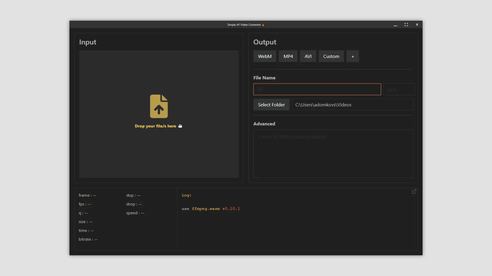

# Simple AF Video Converter 🔥

This project started as a semi-last resort to convert WebM files to MP4. WebM video file format has a known issue where generated files don't support seeking, meaning that the file metadata is incomplete (Total Frames and duration are unknown). Importing the files in Premiere, Adobe Encoder and Blender results in an error, VLC - crashes. Free online solutions were not an option due to NDA.

After trying different solutions for a couple of hours, I created a script based on [FFMPEG](https://ffmpeg.org/) node package, allowing to convert files based on provided parameters. 

To make this solution more accessible to other potential users, who don't feel comfortable editing the script for every conversion, I created an Electron application as a wrapper for the [ffmpeg.wasm](https://github.com/ffmpegwasm/ffmpeg.wasm)

> This is a simple wraper application missing some important features to work ffmpeg, like multiple pass support and (possibly) more (as I'm not an ffmpeg expert/enthusiast).

> I'm not a master at Electron and Svelte. The source code is not perfect, especially the communication between main context and renderer -> svelte app. 

 

*(default)*

*(render setup)*

*(render results)*

>Files can be excluded from the render list

 

# Stack

- [Electron (v17)](https://www.electronjs.org/)
- [electron-builder](https://www.electron.build/)
- [Svelte](https://svelte.dev/)
- [ffmpeg.wasm](https://github.com/ffmpegwasm/ffmpeg.wasm)
- [Bulma](https://bulma.io/)
- [PrismJS](https://prismjs.com/)
- [Rollup](https://rollupjs.org/guide/en/)
- [svelte-fa](https://www.npmjs.com/package/svelte-fa)
- [svelte-toast](https://github.com/zerodevx/svelte-toast)
- [hazardous](https://github.com/epsitec-sa/hazardous)

# Limitations

- Multi-threading need to be configured per external libraries
- Maximum input file size is 2GB
- FFMPEG is running in the main context to take advantage of the Node libraries, meaning that there can be delays during render process with displaying ffmpeg logs (I want to move it to a node child process at some point)
- FFMPEG running in the main context also means that the rendering process stopped separately (either kill the whole app, or wait for the render to complete)

# Useful Resources

- [Supported External Libraries](https://github.com/ffmpegwasm/ffmpeg.wasm-core#configuration)
- [FFMPEG Wiki](https://trac.ffmpeg.org/)
- [H.264 Guide](https://trac.ffmpeg.org/wiki/Encode/H.264)
- [H.265 Guide](https://trac.ffmpeg.org/wiki/Encode/H.265)
- [WebM (VP9) Guide](https://trac.ffmpeg.org/wiki/Encode/VP9)
- [WebM (VP8) Guide](https://trac.ffmpeg.org/wiki/Encode/VP8)
- [AVI (StackExchange)](https://askubuntu.com/questions/83161/use-ffmpeg-to-transform-mp4-to-same-high-quality-avi-file)
- [How To Encode Videos for YouTube](https://trac.ffmpeg.org/wiki/Encode/YouTube)

 

 

with ❤️ by [berlyozzy / Aleksandrs "Sasha" Domkovs](https://github.com/berlyozzy)
